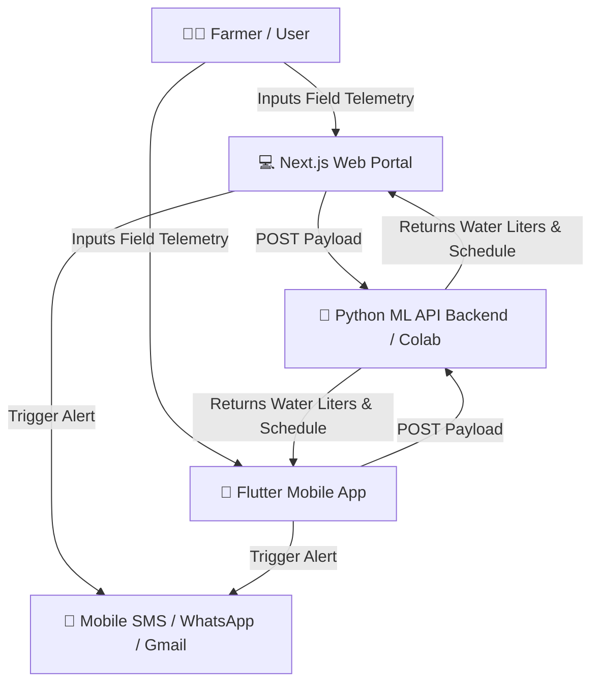

# 🌱 AgroSense — AI-Powered Smart Farmer Irrigation Intelligence

> **Hackathon Edition** | Precision Agriculture & Water Management Platform powered by Real-Time ML Models, Next.js Web Portal, and Flutter Mobile Companion.

---

## 🏆 Project Overview

**AgroSense** is a comprehensive smart irrigation ecosystem designed to help farmers optimize agricultural water consumption, prevent soil over-irrigation, and boost crop yield using Machine Learning.

Traditional irrigation methods cause **over 40% of groundwater wastage** due to manual estimation. AgroSense solves this by integrating:
1. **🧠 Machine Learning Engine**: Predicts exact water requirement (in Liters) based on soil moisture %, crop type, growth stage, soil pH, temperature, humidity, rainfall, and field area.
2. **💻 Web Portal & Dashboard (Next.js)**: Real-time telemetry, zone monitoring, schedule optimizer, and Open-Meteo weather forecast.
3. **📱 Mobile Application (Flutter)**: Cross-platform companion for farmers on Android & iOS with offline support and native device alert handlers.
4. **📲 Multi-Channel Alert Dispatcher**: Direct native mobile SMS, WhatsApp green alerts, and Gmail compose integration.
5. **🌐 100% Multi-Language Support**: Full native localization in **English**, **Hindi (हिंदी)**, and **Kannada (ಕನ್ನಡ)**.

---

## ⚙️ Architecture & Data Flow



---

## ✨ Key Features

- **⚡ Precision Water Calculator**: Dynamic sliders for Soil Moisture (%), Temperature (°C), Field Area (ha), and Rainfall (mm).
- **📊 Real-Time Farmer Dashboard**: Monitors field zones, active critical moisture alerts (<25%), average soil moisture, and total water volume.
- **🌦️ Live Weather Integration**: 7-day weather forecast powered by Open-Meteo API.
- **📲 Direct Device Dispatcher**:
  - `📲 Open Mobile SMS`: Pre-fills native device SMS app (`sms:+91...`).
  - `💬 Send via WhatsApp`: Generates WhatsApp alert card (`https://wa.me/...`).
  - `📧 Open Gmail`: Opens pre-filled Gmail draft (`https://mail.google.com/...`).
- **🌐 Native Multi-Language**: Toggles 100% UI text between English, Hindi, and Kannada.
- **📱 Flutter Mobile Companion**: Cross-platform Android & iOS app with bottom navigation bar and field manager.

---

## 🛠️ Tech Stack

- **Frontend Web**: Next.js 16 (React 19), Tailwind CSS, TypeScript, Lucide Icons
- **Mobile App**: Flutter (Dart 3), Material 3 Design, Google Fonts, URL Launcher, Shared Preferences
- **Backend AI/ML**: Python 3.10, FastAPI / Flask, Scikit-Learn ML Model, Google Colab, Ngrok Tunneling
- **APIs**: Open-Meteo Weather API, Device Native SMS/Mail Schemes

---

## 🚀 Getting Started

### 1️⃣ Run ML Backend (Google Colab / FastAPI)
Start your Colab notebook or FastAPI script and copy your `ngrok` tunnel URL:
```bash
https://your-ngrok-id.ngrok-free.dev
```

### 2️⃣ Run Web Portal (Next.js)
```bash
cd farmer-irrigation-app
npm install
npm run dev
```
Open [http://localhost:3000](http://localhost:3000) in your browser.

### 3️⃣ Run Mobile App (Flutter)
```bash
cd farmer_irrigation_flutter
flutter pub get
flutter run
```

---

## 📄 License
Licensed under the [MIT License](LICENSE). Built for Hackathons 🚀
